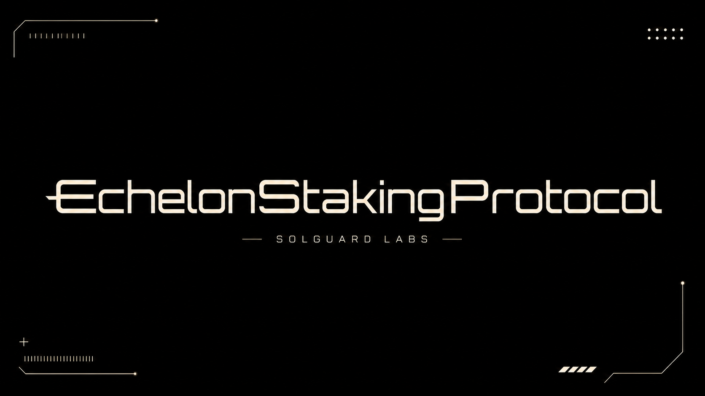
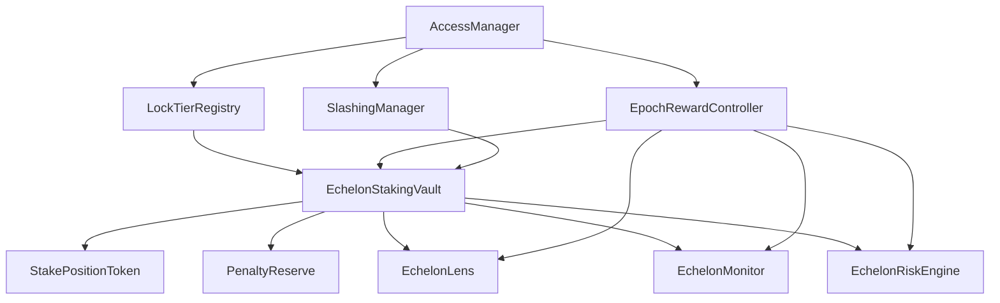
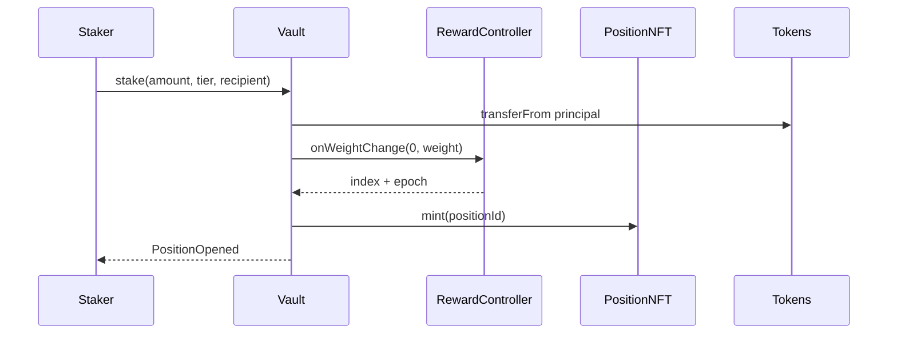
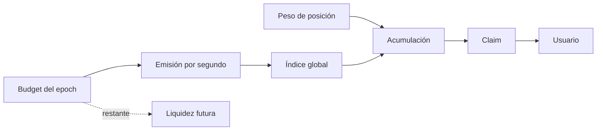

<p align="center">
  
</p>

# Echelon Staking Protocol

[](https://github.com/SolguardLabs/EchelonStakingProtocol/actions/workflows/ci.yml)
[](https://github.com/SolguardLabs/EchelonStakingProtocol/actions/workflows/release-integrity.yml)
[](https://soliditylang.org/)
[](https://getfoundry.sh/)

Echelon es una infraestructura modular de staking ERC-20 con posiciones ERC-721, compromisos por
tier, emisiones programadas por epoch, salidas con penalización lineal y slashing diferido. El
sistema separa custodia, política, recompensas, gobierno, reservas, lectura y analítica de riesgo para
que cada dominio pueda revisarse y operarse de forma independiente.

## Capacidades

- posiciones transferibles con autorización ERC-721;
- tiers configurables con multiplicador, lock, cooldown, mínimo y penalización;
- índice global de recompensa con presupuestos y tasas por epoch;
- acumulación ponderada y checkpoints por posición;
- salida parcial o total con protección de slippage sobre la penalización;
- slashing con evidencia, cola, retardo y cancelación de emergencia;
- roles separados para gobierno, recompensas, guardianes, keepers y slashing;
- conciliación de principal, reserva, supply de posiciones y peso global;
- motor de riesgo con cobertura, runway, stress, capacidad y concentración HHI.

## Arquitectura



El vault es el único custodio del principal. El controller mantiene la liquidez de recompensa y el
índice global. El NFT define propiedad y delegación, pero no almacena magnitudes económicas.



## Modelo económico

Para principal `P`, multiplicador de tier `m` y escala de `10.000` puntos básicos:

```text
weight = floor(P × m / 10 000)
index_delta = floor(emission × 1e27 / total_weight)
position_reward = floor(weight × (index - index_paid) / 1e27)
```

La penalización de salida desciende linealmente desde el máximo comprometido hasta cero en
`unlockAt`. El llamante aporta `maximumPenalty`; la operación revierte si la cotización lo supera.



## Motor de riesgo

`EchelonRiskEngine` es de solo lectura y deriva:

```text
unpaid_emitted = max(0, emitted - skipped - paid)
scheduled_remaining = max(0, configured - emitted)
obligations = unpaid_emitted + scheduled_remaining
coverage_bps = liquidity × 10 000 / obligations
runway_seconds = liquidity / active_reward_rate
```

La evaluación aplica un haircut a la liquidez y clasifica la posición como `Healthy`, `Watch`,
`Constrained` o `Paused`. El modelo también calcula capacidad a cobertura objetivo y concentración
del peso de una cartera mediante HHI.

## Inicio rápido

Requisitos:

- Foundry `1.7.1`;
- Git con soporte de submódulos;
- Solidity `0.8.24`, instalado automáticamente por Foundry.

```bash
git submodule update --init --recursive
forge build --sizes
forge test
```

Validación completa:

```bash
bash scripts/ci.sh
```

Ejecutar una suite concreta:

```bash
bash scripts/tests.sh --match-path test/integration/EpochRewards.t.sol
```

## Despliegue

El script despliega, enlaza y configura todos los módulos, incluido el motor de riesgo.

```bash
cp .env.example .env
source .env

forge script script/DeployEchelon.s.sol:DeployEchelon \
  --rpc-url "$RPC_URL" \
  --broadcast \
  --verify
```

Variables obligatorias:

| Variable | Uso |
| --- | --- |
| `PRIVATE_KEY` | cuenta de despliegue temporal |
| `STAKING_TOKEN` | activo principal ERC-20 |
| `REWARD_TOKEN` | activo de recompensa ERC-20 |
| `RPC_URL` | endpoint de la red objetivo |

Las direcciones de tesorería, reward manager, slasher y guardian deben ser distintas en el entorno
operativo. La cuenta de despliegue transfiere el control administrativo una vez verificados bytecode,
enlaces y parámetros.

## Roles

| Rol | Responsabilidad |
| --- | --- |
| `DEFAULT_ADMIN_ROLE` | transferencia diferida del administrador |
| `GOVERNOR_ROLE` | estructura, módulos y políticas |
| `REWARD_MANAGER_ROLE` | financiación y programación de epochs |
| `SLASHER_ROLE` | propuestas respaldadas por evidencia |
| `GUARDIAN_ROLE` | pausas y cancelación de emergencia |
| `KEEPER_ROLE` | sincronización y mantenimiento operativo |

## Estructura

| Ruta | Responsabilidad |
| --- | --- |
| `src/staking` | custodia y ciclo de posiciones |
| `src/rewards` | presupuestos, emisiones e índice global |
| `src/policy` | tiers, locks, cooldowns y penalizaciones |
| `src/security` | slashing diferido |
| `src/risk` | capital, stress, runway y concentración |
| `src/monitoring` | wiring, saldos, keepers y auditoría por lotes |
| `src/views` | lecturas agregadas para interfaces e indexadores |
| `script` | despliegue y bootstrap |
| `test` | pruebas unitarias, integración e invariantes |

## Documentación

- [Arquitectura](./docs/architecture.md)
- [Modelo económico](./docs/economic-model.md)
- [Recompensas y epochs](./docs/rewards-and-epochs.md)
- [Ciclo de staking](./docs/staking-lifecycle.md)
- [Gobierno y seguridad](./docs/governance-and-security.md)
- [Operaciones](./docs/operations.md)
- [Integración](./docs/integration.md)
- [Política de seguridad](./SECURITY.md)

## Calidad y versiones

CI valida formato, tamaño de bytecode, 65 pruebas públicas, fuzzing, invariantes y artefactos del
repositorio. `main` contiene el estado aprobado; `production` y el tag anotado de una publicación
deben resolver exactamente al mismo commit.

## Licencia

MIT. Consulta [LICENSE](./LICENSE).
