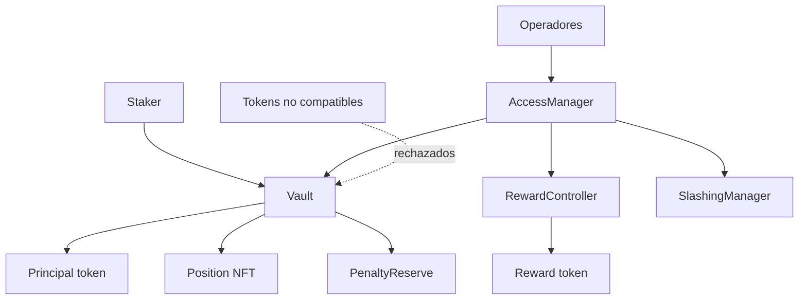
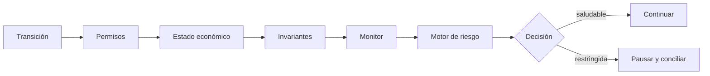
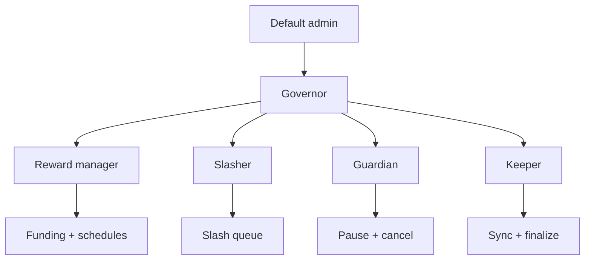

# Seguridad de Echelon Staking Protocol

## Versiones mantenidas

| Versión | Estado | Rama |
| --- | --- | --- |
| 1.0.x | Mantenida | `production` |
| < 1.0 | Sin mantenimiento | Archivo histórico |

## Comunicación responsable

Los hallazgos deben enviarse mediante **GitHub Security Advisories**. No se deben publicar detalles
técnicos sensibles en issues, discusiones ni pull requests abiertos.

Incluye:

- versión, commit, contrato y función;
- precondiciones, permisos y secuencia reproducible;
- efecto sobre principal, rewards, reservas o gobierno;
- prueba mínima sin claves ni datos personales;
- mitigación temporal o corrección propuesta, si existe.

El equipo confirmará recepción, clasificará impacto y coordinará corrección y publicación. Los
casos con pérdida contable o control administrativo tienen prioridad máxima.

## Fronteras de confianza

Se consideran externos los tokens, propietarios, operadores, RPC, indexadores y automatizaciones.
Los contratos verifican saldos exactos en transferencias de principal y recompensa; tokens con
rebasing o fee-on-transfer no forman parte del perfil soportado.

## Objetivos

- el principal contabilizado debe estar completamente respaldado;
- rewards y presupuestos deben permanecer observables por epoch;
- supply de NFT y posiciones activas deben conciliar;
- peso global y suma de pesos activos deben coincidir;
- penalizaciones y principal recortado deben respaldar la reserva;
- un cambio de rol sensible debe seguir su autoridad y retardo;
- pausas de depósito, salida, tier y payout deben ser independientes.

## Controles

| Superficie | Control |
| --- | --- |
| Custodia | balance exacto antes y después de transferencias |
| Reentrada | guard en acciones de estado y pagos |
| Aritmética | Solidity 0.8 y `FullMath.mulDiv` |
| Tiers | mínimo, multiplicador, duración, cooldown y penalización acotados |
| Epochs | presupuesto prefinanciado, tasa acotada y configuración previa al inicio |
| ACK operativo | eventos, índices y checkpoints trazables |
| Slashing | rol, evidencia, delay, cancelación y ejecución idempotente |
| Gobierno | roles separados y transferencia administrativa diferida |
| Riesgo | cobertura, haircut, runway, capacidad y HHI |
| Publicación | refs inmutables y CI sobre tag y release |

## Matriz de permisos

En despliegues operativos, cada rol se asigna a una cuenta o contrato distinto. Gobierno debe usar
multifirma y timelock; guardian puede tener menor latencia, permisos limitados y rotación frecuente.

## Validación previa a publicación

1. Revisar bytecode y tamaños.
2. Ejecutar suite completa con el perfil `ci`.
3. Confirmar cinco invariantes con 512 secuencias y profundidad 128.
4. Verificar wiring de todos los módulos.
5. Conciliar principal, reward liquidity y reserve accounting.
6. Evaluar stress con haircuts del 10 %, 20 % y 35 %.
7. Verificar separación de roles y transferencia de administrador.
8. Ensayar pausa, reanudación y recuperación.

## Respuesta a incidentes

El orden recomendado es: detener la superficie afectada, capturar el bloque y estado, conciliar por
módulo, preservar evidencia, decidir contención y publicar una versión nueva. Los tags existentes no
se mueven; una reversión se representa mediante un commit y una publicación posterior.

## Fuera de alcance

No se consideran componentes del protocolo la seguridad del endpoint RPC, la custodia de claves, la
interfaz de usuario, los oráculos externos no incluidos ni las modificaciones realizadas por terceros.
