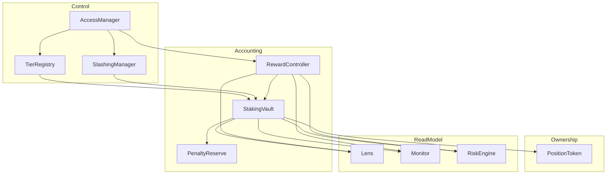
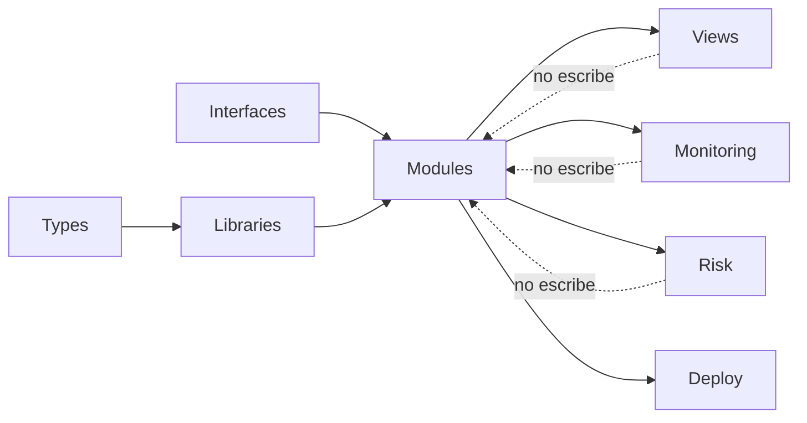
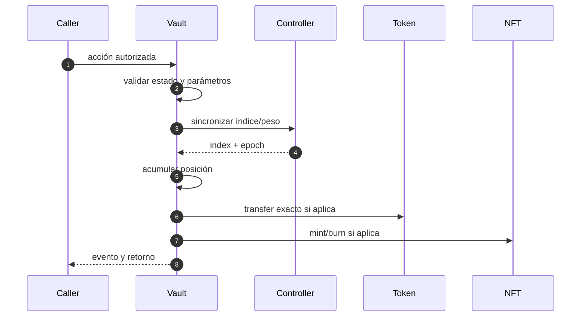

# Arquitectura

## Diseño modular

Echelon divide las responsabilidades que mueven activos de las que definen política o exponen
lecturas. El vault coordina, pero no administra roles, no programa emisiones y no mantiene la
propiedad ERC-721.

## Dependencias

| Módulo | Puede escribir en | Llamadas externas de activos |
| --- | --- | --- |
| Vault | posiciones, principal, peso | staking token, reward controller, reserve, NFT |
| RewardController | epochs, índice, pagos | reward token |
| TierRegistry | configuración de tiers | ninguna |
| PositionToken | ownership y aprobaciones | receptor ERC-721 |
| SlashingManager | cola y estado de solicitudes | vault al ejecutar |
| PenaltyReserve | créditos y retiros | staking token |
| Lens/Monitor/Risk | ninguna | solo lecturas |

## Flujo de escritura

Las mutaciones de principal siguen el orden sincronizar, acumular, actualizar y transferir. Los
contratos de lectura nunca se usan como fuente de autoridad.

## Propiedades de despliegue

- staking token y reward token deben ser distintos;
- controller, NFT, reserve y slashing manager se enlazan una sola vez;
- el deployer configura tiers y roles antes de transferir gobierno;
- lens, monitor y risk engine reciben direcciones inmutables;
- toda dirección desplegada se registra junto a chain ID, commit y bytecode hash.

## Extensión

Una nueva política de tier se implementa en el registry y se consume desde el vault. Una nueva
métrica se añade a Lens, Monitor o RiskEngine sin introducir escritura. Una nueva acción con activos
requiere pruebas de autorización, reentrada, conciliación, pausas y comportamiento de tokens.
