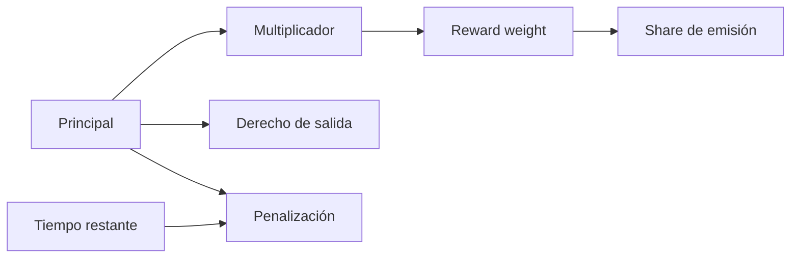
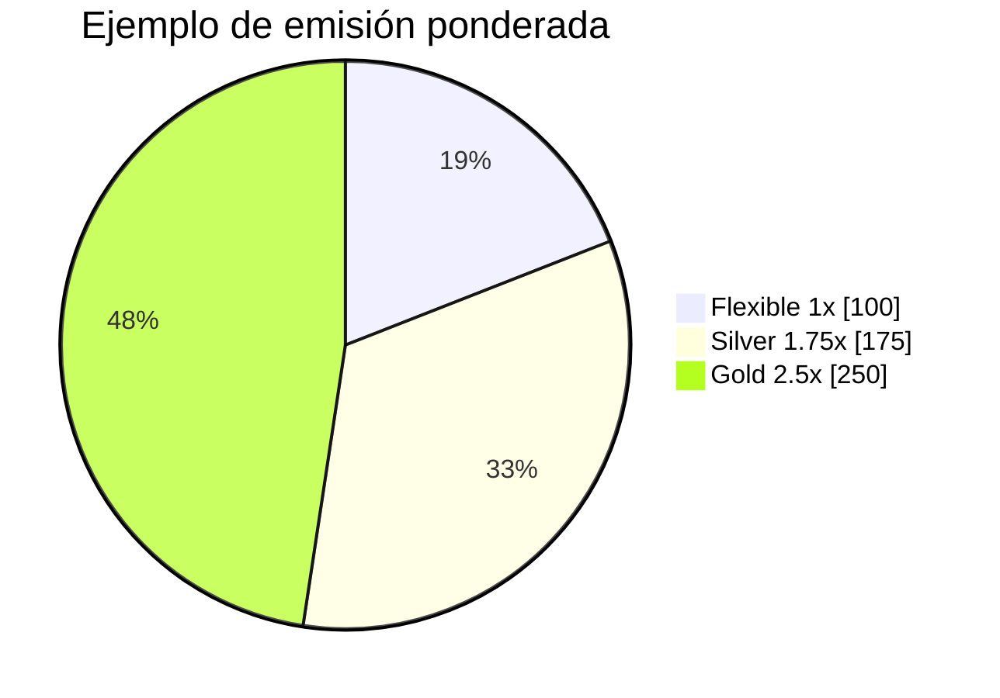
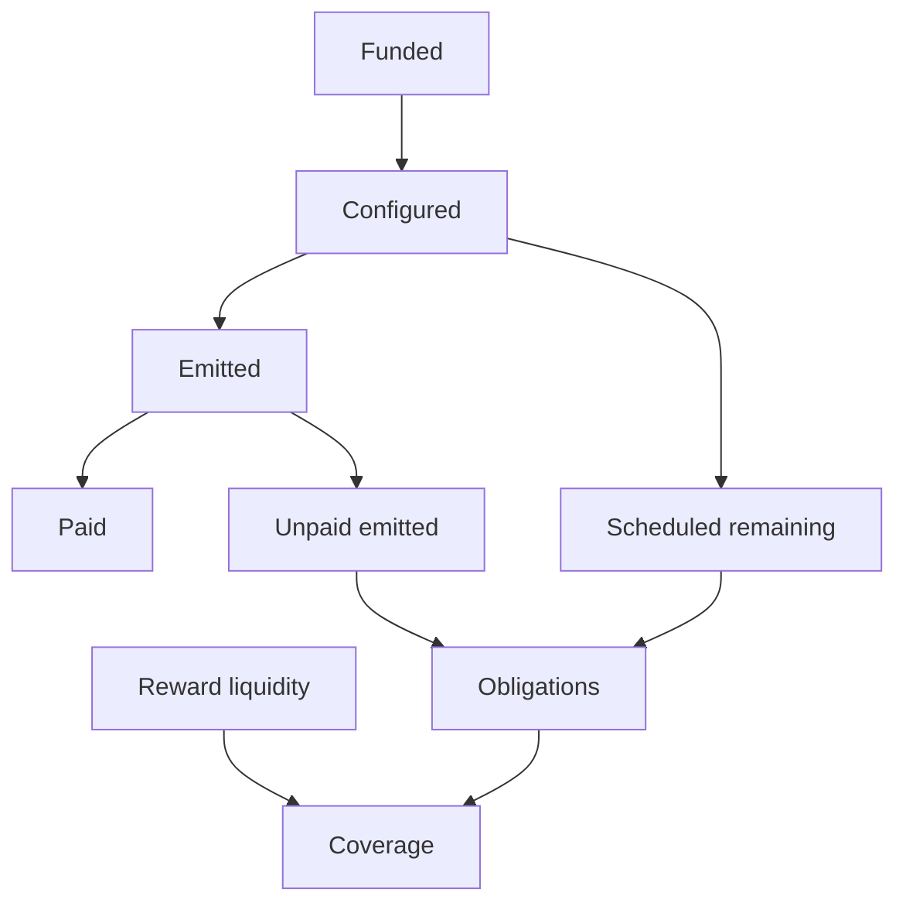

# Modelo económico

## Principal y peso

Cada posición conserva principal `P` y peso `W`. El tier aporta un multiplicador `m` en puntos
básicos:

```text
W = floor(P × m / 10 000)
```

El principal define el derecho de salida; el peso define participación en emisiones. Cambiar uno no
implica transferir el otro.



## Distribución por índice

Para emisión `E`, peso total `TW` y escala `RAY = 1e27`:

```text
index_delta = floor(E × RAY / TW)
reward_i = floor(W_i × (index - index_paid_i) / RAY)
```

El dust permanece en el controller. Si `TW = 0`, la emisión se registra como `skippedRewards` y no
se asigna retroactivamente.



## Penalización lineal

Sea `p_max` el máximo comprometido, `t0` el inicio y `tu` el unlock:

```text
remaining = max(0, tu - now)
duration = tu - t0
penalty_bps = floor(p_max × remaining / duration)
penalty = floor(withdrawn × penalty_bps / 10 000)
```

Una extensión de compromiso nunca reduce `unlockAt` ni la penalización vigente. Una posición madura
puede iniciar un compromiso nuevo al elegir otro tier.

## Capital de recompensas



El modelo de riesgo usa:

```text
obligations = unpaid_emitted + scheduled_remaining
coverage = reward_liquidity / obligations
stress_liquidity = reward_liquidity × (1 - haircut)
capacity = max(0, stress_liquidity / target_coverage - obligations)
```

## Concentración

Para shares de peso `s_i` expresados en puntos básicos:

```text
HHI = sum(s_i²)
```

El rango es aproximadamente 0–100.000.000. Dos posiciones iguales producen 50.000.000; una cartera
dominada por una sola posición se aproxima a 100.000.000.

## Escenarios de stress

| Escenario | Haircut | Cobertura mínima | Acción |
| --- | ---: | ---: | --- |
| Base | 0 % | 100 % | operación normal |
| Liquidez reducida | 10 % | 120 % | vigilar capacidad |
| Mercado severo | 20 % | 125 % | reducir nuevos compromisos |
| Contención | 35 % | 150 % | pausar y recapitalizar |

Los umbrales son política externa; el motor de riesgo no cambia el estado.
