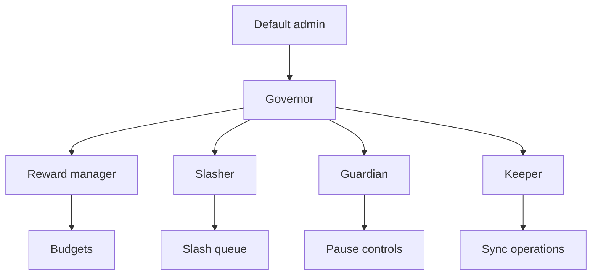
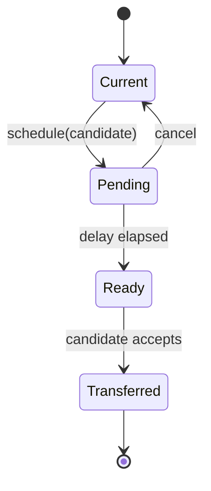
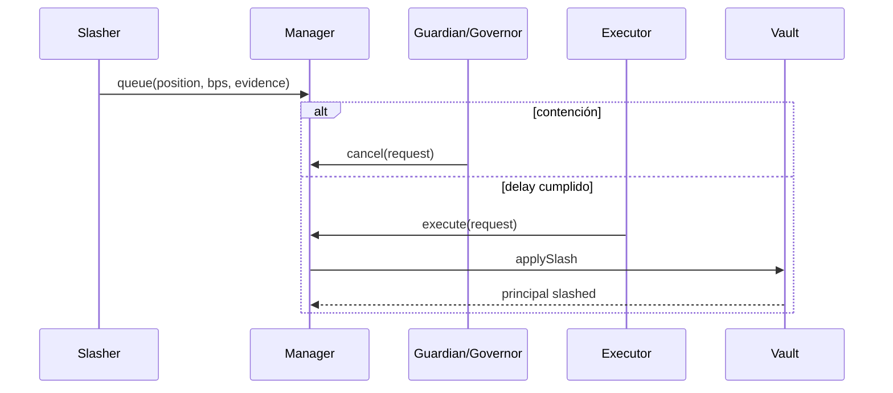

# Gobierno y seguridad

## Separación de funciones

El default admin controla la jerarquía y su propia transferencia diferida. Governor gestiona
configuración estructural. Los roles operativos no deben compartir firmantes salvo procedimiento de
emergencia documentado.

## Transferencia administrativa

La transferencia requiere propuesta del administrador actual, espera y aceptación del candidato.
No se permite renunciar al rol por la ruta ordinaria.

## Slashing diferido

La evidencia se representa por hash. La ejecución es permissionless una vez cumplido el retardo;
esto evita depender de disponibilidad continua del slasher.

## Pausas

| Pausa | Bloquea | No bloquea |
| --- | --- | --- |
| Deposits | stake e increase | claim y exits |
| Exits | unstake | claim y nuevos depósitos |
| Tier changes | changeTier | claim e increase |
| Payouts | transferencias de reward | sync y principal |

Las pausas separadas reducen el radio operativo de una contención.

## Tokens soportados

Se requieren ERC-20 con transferencias exactas. El vault y controller comparan balances antes y
después. No se admiten tokens con fee-on-transfer, rebasing, callbacks no estándar o comportamiento
que cambie saldos sin transferencia.

## Revisión de cambios

Todo cambio sensible debe incluir:

- mapa de roles y llamadas externas;
- transiciones antes/después;
- efecto sobre principal, peso, rewards y reservas;
- pruebas de pausa, reentrada y permisos;
- invariantes y escenario de recuperación;
- plan de migración sin mover tags existentes.
