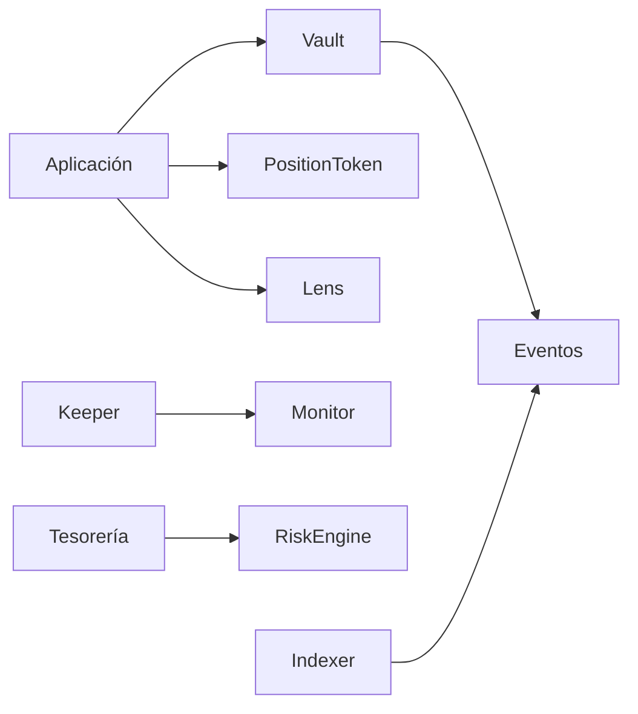
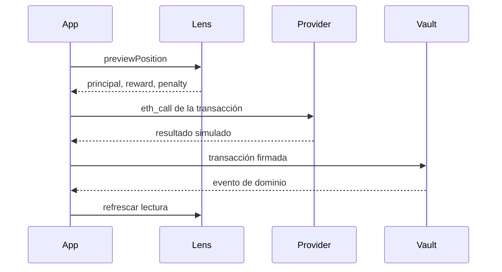
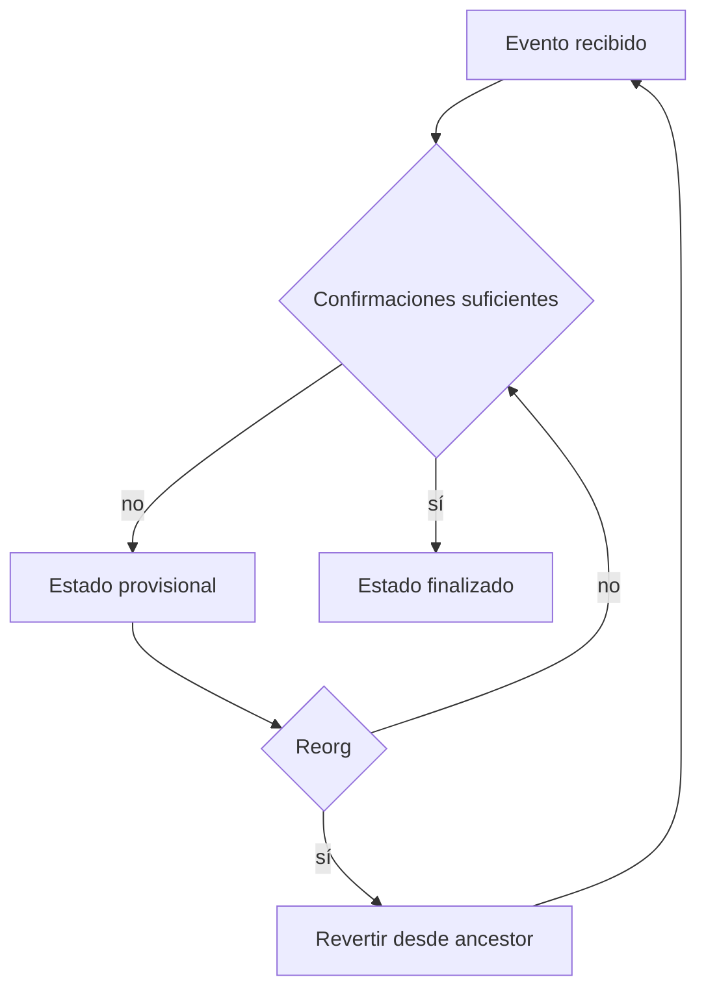

# Integración

## Superficies

Las aplicaciones escriben contra Vault y PositionToken. Para lectura agregada usan EchelonLens;
keepers usan EchelonMonitor y tesorería consume EchelonRiskEngine.



## Escrituras

Antes de enviar una transacción:

1. leer propiedad o aprobación del NFT;
2. consultar tier y estado de pausa;
3. obtener preview de posición;
4. establecer destinatario y límite de penalización;
5. simular con el mismo bloque;
6. enviar y esperar confirmaciones;
7. conciliar eventos y estado final.



## Eventos para indexación

| Evento | Clave principal | Uso |
| --- | --- | --- |
| `PositionOpened` | `positionId` | alta de posición |
| `PositionIncreased` | `positionId` | cambio de principal |
| `TierChanged` | `positionId` | cambio de política y peso |
| `RewardClaimed` | `positionId` | pago de rewards |
| `PositionWithdrawn` | `positionId` | salida y penalización |
| `PositionSlashed` | `positionId`, `evidenceHash` | reducción de principal |
| `EpochConfigured` | `epochId` | calendario de emisión |
| `GlobalIndexUpdated` | `epochId`, `timestamp` | replay del índice |

## Lectura de riesgo

```solidity
EchelonRiskEngine.RiskPolicy memory policy = EchelonRiskEngine.RiskPolicy({
    minimumCoverageBps: 12_500,
    maximumPayoutUtilizationBps: 8_000,
    stressHaircutBps: 2_000,
    minimumRunwaySeconds: 14 days
});

EchelonRiskEngine.StressReport memory report = riskEngine.assess(policy);
```

El consumidor debe mostrar magnitudes en unidades del reward token y ratios en puntos básicos.

## Reorganizaciones



El indexador guarda bloque, hash de bloque, tx hash y log index. Tras una reorganización elimina el
segmento no canónico y reproduce eventos en orden.

## Compatibilidad

Los contratos no son proxies. Las direcciones forman parte de la versión de despliegue. Una
integración debe cargar un manifest por chain ID y verificar wiring antes de habilitar escrituras.
