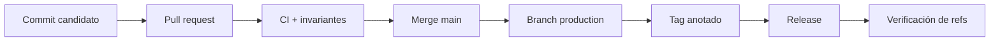
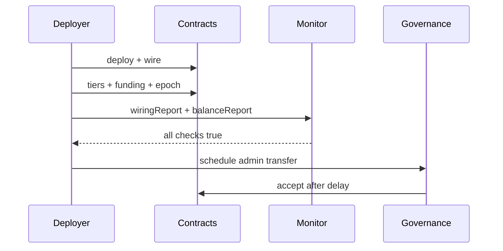
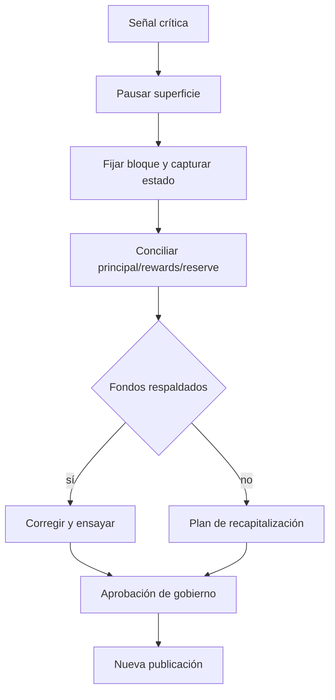

# Operaciones

## Flujo de publicación

`main`, `production` y el tag pelado deben apuntar al mismo commit. La release se publica solo cuando
los tres eventos han finalizado correctamente.

## Checklist de despliegue

1. Fijar chain ID, RPC, tokens y roles.
2. Confirmar que staking token y reward token son distintos.
3. Simular el script sin broadcast.
4. Revisar tamaños y bytecode.
5. Desplegar y guardar direcciones.
6. Verificar wiring de controller, NFT, reserve y slashing manager.
7. Configurar tiers iniciales.
8. Financiar y programar el primer epoch.
9. Asignar roles operativos.
10. Transferir administración al gobierno final.

## Monitorización

| Frecuencia | Señal |
| --- | --- |
| cada bloque | pausas, pagos y eventos de slashing |
| 5 minutos | reward liquidity, principal backing y reserve backing |
| por hora | index staleness, runway y cobertura |
| por epoch | budget, emission, skipped, paid y finalization |
| diaria | concentración de peso y roles |

## Runbook de contención

No se reanudan operaciones hasta obtener dos snapshots consistentes consecutivos y una aprobación
explícita del gobierno.

## Evidencia

Conservar commit, tag, chain ID, direcciones, bytecode hashes, transacciones de despliegue, roles,
configuración de tiers, epochs, reportes del monitor y evaluaciones de stress. Los secretos nunca se
incluyen en logs ni artefactos.

## Reversión

Los contratos son modulares y no dependen de un proxy. Una sustitución requiere desplegar un sistema
nuevo y un procedimiento de migración aprobado. Los tags publicados son inmutables.
