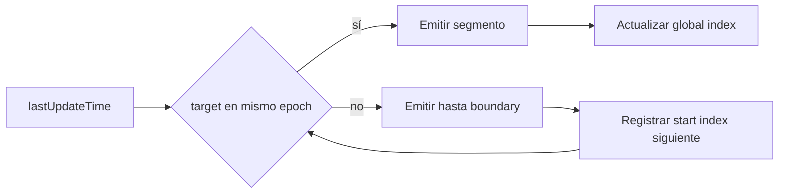
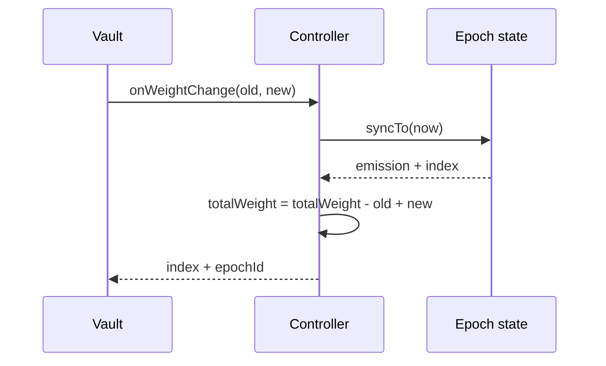

# Recompensas y epochs

## Programación

Cada epoch define inicio, fin, presupuesto, tasa, estado habilitado y emisión realizada. Debe
configurarse antes de comenzar y disponer de financiación agregada suficiente.

```mermaid
gantt
    title Calendario de emisiones
    dateFormat X
    axisFormat %s
    section Rewards
    Epoch 0 :0, 7
    Epoch 1 :7, 14
    Epoch 2 :14, 21
```



La condición de admisión es:

```text
reward_rate × epoch_duration <= reward_budget
total_configured + new_budget <= total_funded
```

## Sincronización



`sync` recorre como máximo 64 fronteras. Tras inactividad prolongada, un keeper usa
`syncNextEpoch` repetidamente para avanzar de forma acotada.

## Cambio de peso

`onWeightChange(oldWeight, newWeight)` sincroniza el índice al timestamp actual, comprueba que el
peso retirado existe y actualiza el total:

```text
TW_next = TW_previous - oldWeight + newWeight
```

La función solo puede ser llamada por el vault enlazado.



## Finalización

Un epoch puede finalizar después de `endTime`. La operación sincroniza primero y registra presupuesto
no utilizado. Finalizar no transfiere activos automáticamente ni modifica epochs futuros.

## Runway

Durante un epoch activo:

```text
runway_seconds = reward_liquidity / reward_rate
```

Se recomienda alertar cuando el runway cae por debajo de dos duraciones de epoch, y restringir nueva
programación cuando cae por debajo de una. La cobertura de obligaciones debe evaluarse en paralelo.

## Operación del keeper

1. Consultar `currentEpoch`, `lastUpdateTime` y `secondsSinceUpdate`.
2. Ejecutar `syncNextEpoch` si el atraso cruza una frontera.
3. Repetir hasta alcanzar el timestamp objetivo.
4. Finalizar epochs concluidos.
5. Publicar snapshot de capital y hash de transacción.

Los keepers no necesitan custodiar activos ni disponer de autoridad sobre presupuestos.
