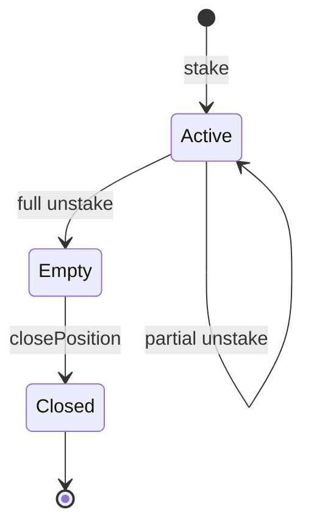
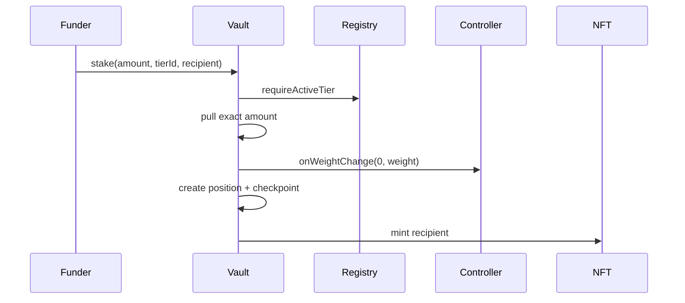
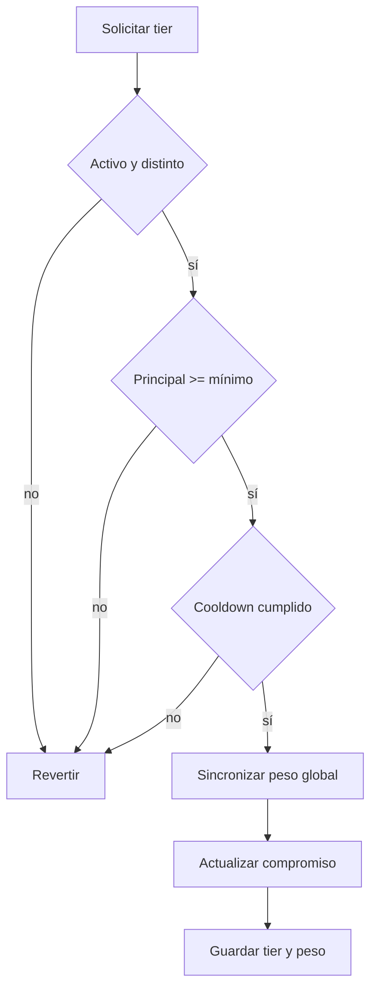

# Ciclo de staking

## Estados

Una posición pasa de inexistente a activa y finalmente cerrada. Principal cero no cierra el NFT de
forma implícita: el cierre exige también rewards pendientes cero y ausencia de slash en cola.

## Apertura

El timestamp de apertura inicia compromiso, cooldown y checkpoint. El NFT puede pertenecer a una
dirección distinta del financiador.

## Aumento

Un aumento acumula rewards con el peso vigente, recibe principal exacto, calcula el peso nuevo y
renueva el compromiso del tier actual. Debe dejar la posición por encima del mínimo configurado.

## Cambio de tier

El nuevo lock no puede acortar un compromiso activo. Si la posición ya maduró, comienza un
compromiso nuevo desde el cambio.

## Salida

`unstake` admite retiro parcial. El llamante fija `maximumPenalty`, el vault calcula la penalización
actual, envía esa parte a la reserva y transfiere el neto al destinatario. Un slash pendiente bloquea
la salida de principal hasta ser ejecutado o cancelado.

## Propiedad y operadores

El propietario, una dirección aprobada para el token o un operador global puede gestionar la
posición. Transferir el NFT mueve los derechos de gestión sin cambiar principal, tier, lock, peso ni
checkpoint.

## Cierre

Antes de quemar el NFT:

- principal igual a cero;
- rewards almacenadas y pendientes iguales a cero;
- ninguna solicitud de slash pendiente;
- posición en estado activo.

El evento `PositionClosed` conserva el propietario final para indexación.
